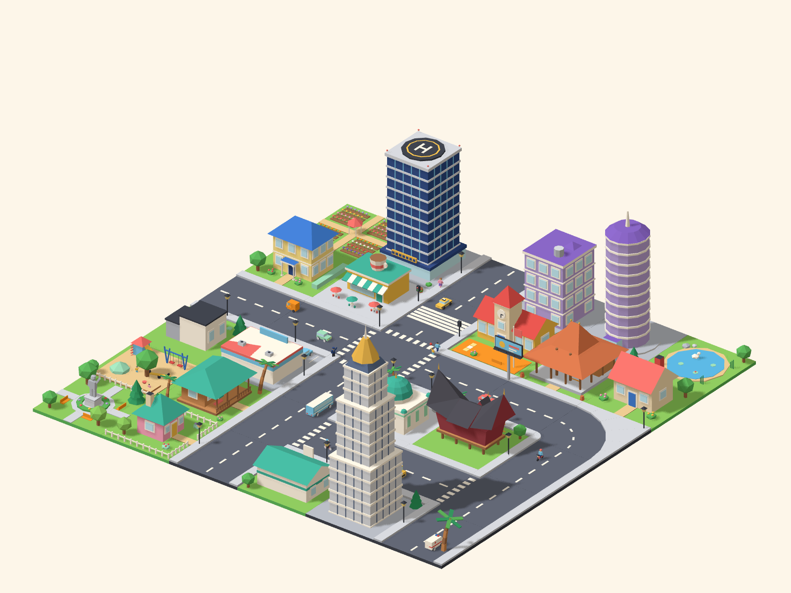
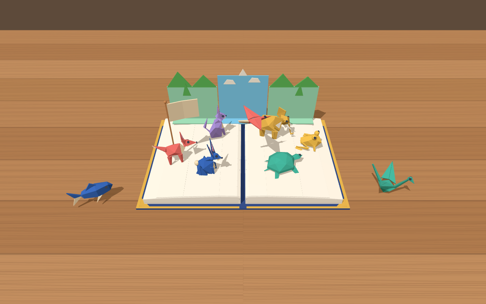
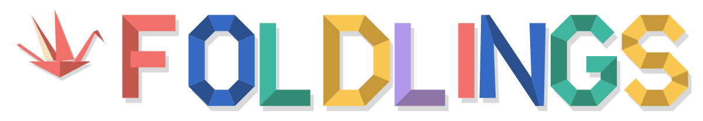

# Origami City Assets

Colourful, low-poly 3D models for a city-building game in a flat **origami paper** style:
faceted geometry, flat shading and bright paper colours.



## What's here

| Folder | Contents |
| --- | --- |
| `models/buildings/`, `models/areas/`, `models/objects/` | One `.glb` (glTF 2.0 binary) per asset |
| `models/manifest.json` | Every asset with its category, sheet, footprint (in tiles), triangle count and bounds |
| `previews/` | A PNG per asset, one `sheet_<group>.png` contact sheet per group, and `town.png` |
| `docs/CATALOG.md` | The full catalog plan (in Indonesian) with the status of every asset |
| `scripts/` | The generator: every model is built from code, so it can be tweaked and rebuilt |

**199 assets** in 16 groups, each with its own contact sheet:

| Group | Count | Sheet |
| --- | --- | --- |
| Houses | 20 | [sheet_houses.png](previews/sheet_houses.png) |
| Offices | 10 | [sheet_offices.png](previews/sheet_offices.png) |
| Public services | 19 | [sheet_public.png](previews/sheet_public.png) |
| Commercial | 10 | [sheet_commercial.png](previews/sheet_commercial.png) |
| Industry | 3 | [sheet_industry.png](previews/sheet_industry.png) |
| Roads, paths, highway, rail | 26 | [sheet_roads.png](previews/sheet_roads.png) |
| Parks | 9 | [sheet_parks.png](previews/sheet_parks.png) |
| Sports | 7 | [sheet_sports.png](previews/sheet_sports.png) |
| Zoo | 7 | [sheet_zoo.png](previews/sheet_zoo.png) |
| Nature | 7 | [sheet_nature.png](previews/sheet_nature.png) |
| People | 15 | [sheet_people.png](previews/sheet_people.png) |
| Vehicles | 18 | [sheet_vehicles.png](previews/sheet_vehicles.png) |
| Trees and plants | 15 | [sheet_plants.png](previews/sheet_plants.png) |
| Street props | 18 | [sheet_props.png](previews/sheet_props.png) |
| Billboards | 5 | [sheet_billboards.png](previews/sheet_billboards.png) |
| Animals | 10 | [sheet_animals.png](previews/sheet_animals.png) |

## Foldlings game assets

The repository also holds the assets for **Foldlings**, a mixed-reality maths game (WebXR on Meta Quest):
origami animals that walk out of a pop-up book on the player's table. They share this set's palette and
paper style but are measured in **metres** and carry named nodes, anchors and animation clips.



| Folder | Contents |
| --- | --- |
| `models/foldlings/` | 8 Foldlings (fox, rabbit, crane, turtle, frog, fish, cat, elephant) in 5 mission colours + a rare gold variant, the paper bird and the number flag |
| `models/book/` | Open pop-up book, closed book, pop-up backdrop frame |
| `models/game/` | Props for the six mini games (Orb Forge, Balloon Burst, Factory Sort, Bridge Builder, Balance Gate, Measure Hunt) and the portals |
| `models/hints/` | Visual hint models: base-ten blocks, number line, bar strip, area grid, pie slices |
| `models/characters/` | Pip the owl, The Great Crumple (3 stages) and three robot partners |
| `models/buildings/skill_*`, `models/areas/town_page_grid` | Fold Town skill buildings in three tiers and the town page base (tile units) |
| `models/rewards/`, `models/ui/`, `models/fx/` | Stars, badges, shield, trophy; paper button, panel and palm menu; confetti, scraps, crease, sparkle |
| `models/scale.json` | City scale on the book page (`city_tile_on_book_m`) |
| `2d/` | SVG + PNG: avatars (8 species × 5 missions), picture-password symbols, logo, app icon, favicon, game and mission icons, Devpost and social images. `2d/backgrounds/`: matte paper menu backgrounds (1920×1080 JPG + SVG) with label slots that peel up from the sheet (left edge fixed) in 3 layouts × 5 colours; slot rectangles in `menu_layout.json`. `2d/labels/`: transparent PNG labels (paper face, peel shadow, paper lettering) to lay on a matching background |

Technical guide: [`docs/FOLDLINGS.md`](docs/FOLDLINGS.md). Batch status: [`docs/CATALOG.md`](docs/CATALOG.md).
Sheets: [foldlings](previews/sheet_foldlings.png), [variants](previews/sheet_foldlings_variants.png),
[book](previews/sheet_book.png), [colour-vision check](previews/cvd_foldlings.png).

### Origami animals from two books

47 more animals in `models/origami-animals/` (11 land, 5 water, 5 insects and reptiles, 4 mythical, 22 birds), folded-paper style
with a white underside colour, same rig and clips as the Foldlings. Guide: [`docs/ORIGAMI_ANIMALS.md`](docs/ORIGAMI_ANIMALS.md).
Sheets: [land](previews/sheet_origami_land.png), [water](previews/sheet_origami_sea.png),
[small](previews/sheet_origami_small.png), [mythical](previews/sheet_origami_myth.png), [birds](previews/sheet_origami_birds.png).



## Conventions (city set)

- **1 unit = 1 grid tile.** A 1×1 asset spans x and z from -0.5 to 0.5; a 2×1 asset spans x from -1 to 1.
  y is up and the ground is at y = 0 (buildings and areas have a 0.04-thick paper base plate).
- **Buildings face +z.** Rotate in 90° steps around y to face a road.
- **Roads** are authored in one orientation and snap together edge to edge:
  - `road_straight` runs along z
  - `road_corner` joins the +x and +z edges
  - `road_t` runs along z with a branch to +x
  - `road_cross` joins all four edges
- **Roads** of other types (`path_`, `road_dirt_`, `avenue_`, `highway_`, `rail_`, `nature_river_`) follow
  the same rule: straight pieces run along z and corners join the +x and +z edges.
- **Objects** (people, vehicles, plants, props, billboards, animals) have no base plate, stand on y = 0
  and share the buildings' scale: a person is about 0.1 units tall and a car about 0.2 units long.
- Materials are plain PBR colours (metallic 0, roughness 0.95) named after the palette entry,
  with no textures, so they are easy to recolour in any engine. Normals are per face for the
  faceted paper look.

The files load directly in Unity (via glTFast), Godot, Unreal, three.js, Babylon.js and Blender.

## Rebuilding

```sh
npm install
npm run build                 # regenerate every model
npm run build -- house_       # only assets whose name starts with house_
npm run previews              # re-render every preview (headless Chromium + three.js)
npm run previews -- houses    # only one sheet (or `town`)
npm run validate              # Khronos glTF validator over every model
npm run previews:game         # Foldlings previews (or `-- foldlings`, `-- foldling_fox`, `-- table`)
npm run build:2d              # Foldlings 2D assets in 2d/ (or `-- avatars`, `-- brand`, ...)
```

- Colours live in `scripts/lib/palette.mjs`; changing one recolours every model that uses it.
- Assets live in `scripts/assets/<group>.mjs` and are registered in `scripts/assets/index.mjs`.
  Shared pieces (windows, doors, trees, cars, pools...) are in `scripts/lib/parts.mjs`.
- Each asset is a small function built from boxes, gable and hip roofs,
  prisms, cones and faceted "paper ball" shapes (`scripts/lib/geom.mjs`).
- `scripts/lib/glb.mjs` is a dependency-free GLB writer. The output passes the Khronos glTF
  validator with no errors or warnings.

## Ownership and licence

All assets were created from 29 September 2026 onwards by Zia, who owns both the `sayazia` GitHub
account (this repository) and the `eziedutech` account that publishes the Foldlings game; the git history
is the record. They were built from code with the help of a code assistant. No third-party fonts,
images, models or brand colours are used anywhere.

Models and images are released under **CC0 1.0**, the generator scripts under the **MIT** licence.
See [`LICENSE`](LICENSE).
